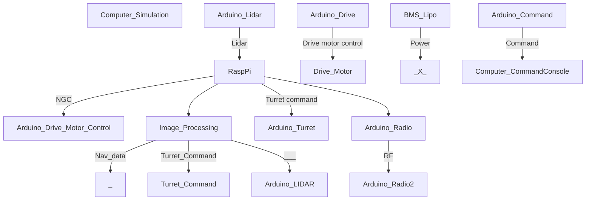

# ParsAy IKA

- Drive Motor Control
- Image Processing
  - Turret Command 
  - Nav Data Output
- BMS
- Radio Communication
- NGC (Navigation Guidance System)
- LIDAR
- Simulation

```mermaid
graph TD;
    Computer_Simulation 

    RaspPi -->|NGC| Arduino_Drive_Motor_Control;
    RaspPi -->  Image_Processing;
    RaspPi -->|Turret command| Arduino_Turret;
    RaspPi --> Arduino_Radio;
    
    Image_Processing -->|Nav_data| _ ;
    Image_Processing -->|Turret_Command| Turret_Command ;
    Image_Processing -->|___| Arduino_LIDAR
            
    Arduino_Drive -->|Drive motor control| Drive_Motor;
    Arduino_Radio -->|RF| Arduino_Radio2;
    
    BMS_Lipo -->|Power| _X_;
    
    Arduino_Lidar -->|Lidar| RaspPi;

    Arduino_Command -->|Command| Computer_CommandConsole;
```
