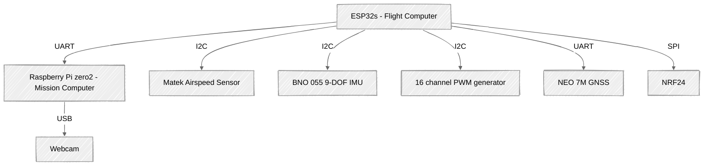

# SOTT Unmanned Aerial Vehicle

This is the public repository of the S**ksen Olmaz Teknofest Team

```mermaid
---
config:
  look: handDrawn
  theme: neutral
---
graph TD

    FC["ESP32s - Flight Computer"]
    MC["Raspberry Pi zero2 - Mission Computer"]

    FC -->|I2C| IAS["Matek Airspeed Sensor"]
    FC -->|I2C| IMU["BNO 055 9-DOF IMU"]
    FC -->|I2C| PWM["16 channel PWM generator"]
    FC -->|UART| GNSS["NEO 7M GNSS"]
    FC -->|SPI| NRF["NRF24"]
    FC -->|UART| MC

    MC -->|USB| CAM["Webcam"]

```
